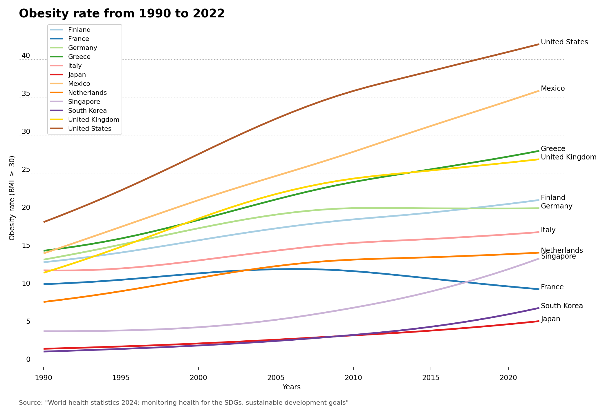

# Obesity prevalence per country

Age-standardized prevalence of obesity among adults (18+ years), defined as those who have a body mass index (BMI) greater than 30. The repository contains a line plot of obesity rates for a selection of countries from 1990 to 2022.

Data is from the [World Health Organization](https://data.who.int/indicators/i/C6262EC/BEFA58B "https://data.who.int/indicators/i/C6262EC/BEFA58B"), and the official report can be found at [World health statistics 2024: monitoring health for the SDGs, sustainable development goals](https://www.who.int/en/publications/i/item/9789240094703 "https://www.who.int/en/publications/i/item/9789240094703"). Official estimate updated, 29 February 2024.
